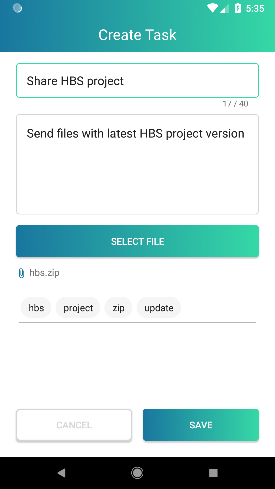
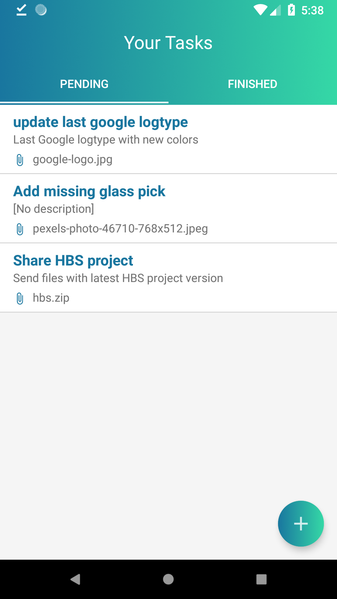
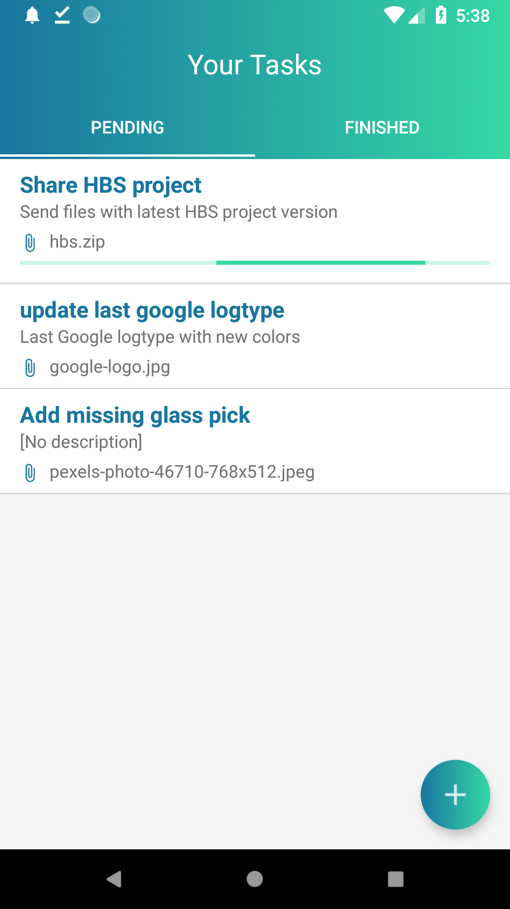
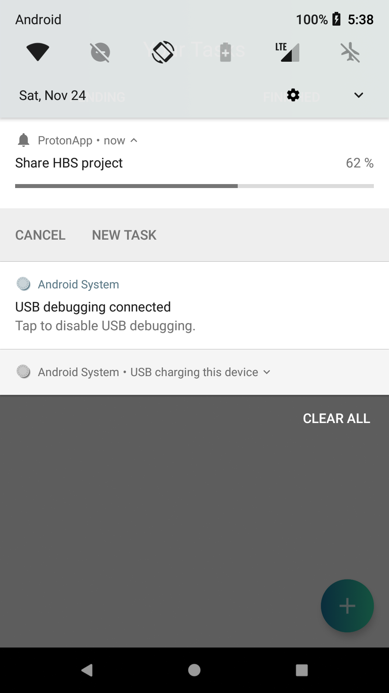
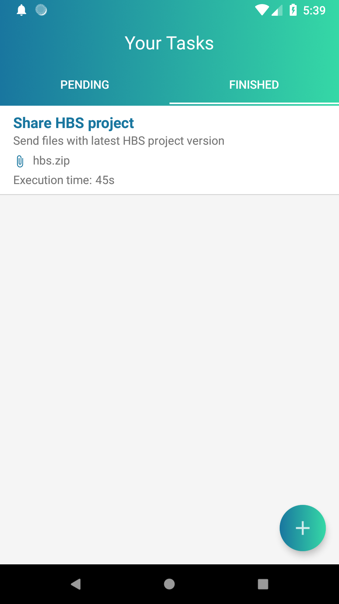

# Task Management Application
Simple application to create, schedule and run tasks used for uploading files to Dropbox storage.

## Demo
||||
|||

### Google components used in project
* [ViewModel][10]
* [LiveData][15]
* [WorkManager][11] (alpha11)
* [Paging][12] (beta01)
* [Room][13] (alpha02)
* [DataBinding][14]

[10]: https://developer.android.com/topic/libraries/architecture/viewmodel
[11]: https://developer.android.com/topic/libraries/architecture/workmanager
[12]: https://developer.android.com/topic/libraries/architecture/paging/
[13]: https://developer.android.com/topic/libraries/architecture/room
[14]: https://developer.android.com/topic/libraries/data-binding/
[15]: https://developer.android.com/topic/libraries/architecture/livedata

### Some of 3rd party libs used in project
* [RxJava2][20]
* [Kodein][21]
* [Dropbox-Sdk][22]
* [Toasty][23]
* [Nachos][24]
* [Stetho][25]
* [Dart][26]

[20]: https://github.com/ReactiveX/RxJava
[21]: https://github.com/Kodein-Framework/Kodein-DI
[22]: https://github.com/dropbox/dropbox-sdk-java
[23]: https://github.com/GrenderG/Toasty
[24]: https://github.com/hootsuite/nachos
[25]: https://github.com/facebook/stetho
[26]: https://github.com/f2prateek/dart

Developed By
------------

* Adam Szkup  - <szkup.a@gmail.com>
